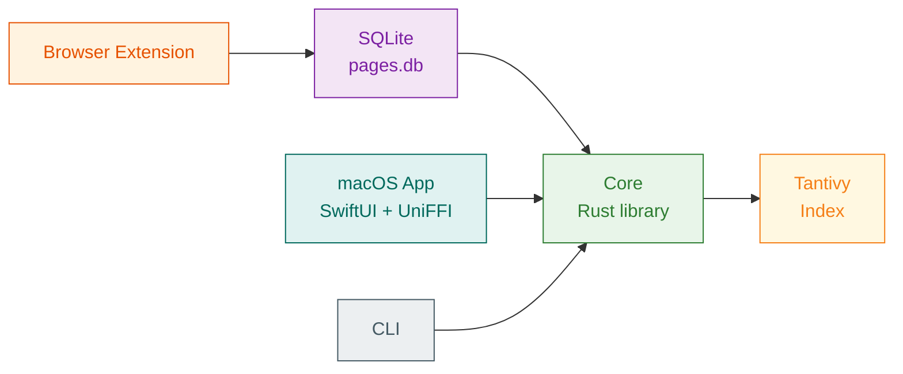

# Alexandria: Search What You've Seen

<p align="center">
  
</p>

The library at Alexandria was said to take a copy of every book that passed through the harbour. This project aims to do the same for every webpage you come across as you browse. Page content is captured, filtered, and indexed for future searching.

## Rationale

I often want to find some insightful comment or story I read months ago, but forget exactly where I found it, and general search engines are getting worse at finding useful content with the amount of SEO+LLM content everywhere.

This project aims to solve that by populating a search index with just the comments you have seen.

## Architecture



- **Capture**: Firefox extension grabs the DOM, serialises it (stripping sensitive components), and sends it via native messaging to a Rust host that deduplicates and stores it in `pages.db` (zstd-compressed). Most sites are boiled down to plaintext. Some special-cased sites are stored as HTML to allow more powerful transformations.
- **Ingest**: The Rust core reads stored pages, indexing them into a Tantivy search store. Pages stored as HTML are filtered using custom per-site transformation rules (to improve index quality for key sites)
- **Search**: Queries are run against the Tantivy index. In the future semantic search may also be used.
- **Frontends**: macOS app and CLI (`alex`) front the core library
- **Power-aware**: macOS app pauses indexing on low battery and Low Power Mode
- **Shared blocklist**: `blocklist.json` filters sensitive URLs in both the extension and the indexer

## Quick Start

```bash
# Build
cargo build --workspace

# Search
./target/debug/alex search "rust async"

# Show help
./target/debug/alex --help
```

## Project Structure

```
alexandria/
  crates/
    core/             # Library: ingestion, indexing, search, FFI
    cli/              # CLI binary (`alex`)
    browser-native-host/ # Native messaging host for Firefox
  macos/              # Swift macOS app (SwiftUI + UniFFI)
  extension/          # Firefox extension
  docs/
    architecture/     # Design docs
    api/              # API reference
    guides/           # Development guides
```

## Documentation


- [Architecture Overview](docs/architecture/README.md)
- [Data Model](docs/architecture/data-model.md)
- [Ingestion](docs/architecture/ingestion.md)
- [Search](docs/architecture/search.md)
- [FFI](docs/architecture/ffi.md)
- [Power Management](docs/architecture/power-management.md)
- [Rust Public API](docs/api/rust-public-api.md)
- [CLI Reference](docs/api/cli-reference.md)
- [Development Setup](docs/guides/development-setup.md)
- [Roadmap](docs/roadmap.md)


## License

[GNU Affero General Public License v3.0](LICENSE.txt)


## FAQs

>"Wait, your logo is of Pharos, not the library of Alexandria!"

I know, but it makes for a more interesting icon that I think conveys the idea of search better.
